# API CRUD con Django y Django REST Framework

## Índice

1. [Introducción](#introducción)
2. [Requisitos Previos](#requisitos-previos)
3. [Configuración del Proyecto](#configuración-del-proyecto)
4. [Dockerization](#dockerization)
5. [Creación del Modelo](#creación-del-modelo)
6. [Implementación del Serializador](#implementación-del-serializador)
7. [Creación de Vistas API](#creación-de-vistas-api)
8. [Configuración de URLs](#configuración-de-urls)
9. [Prueba de la API](#prueba-de-la-api)
10. [Mejores Prácticas](#mejores-prácticas)
11. [Recursos Adicionales](#recursos-adicionales)

## Requisitos Previos

- Python 3.8+
- pip (gestor de paquetes de Python)
- Docker and Docker Compose
- Workbench instalado para hacer pruebas en local de ser necesario

## Clona la Rama `simple-rest-CRUD`

```bash
git clone -b django-restf-deploy --single-branch https://github.com/Factoria-F5-madrid/Python_Deployment_Automate.git
```

### Estructura de carpetas
```plaintext

crud_python/ # Carpeta donde guardas tu proyecto
│
├── sistema_libros/
│   ├── __init__.py
│   ├── settings.py
│   ├── urls.py
│   ├── asgi.py
│   └── wsgi.py
│
├── libros/
│   ├── __init__.py
│   ├── admin.py
│   ├── apps.py
│   ├── models.py
│   ├── serializer.py
│   ├── tests.py
│   ├── urls.py 
│   ├── views.py
│ 
├── categorias/
│   ├── __init__.py
│   ├── admin.py
│   ├── apps.py
│   ├── models.py
│   ├── serializer.py
│   ├── tests.py
│   ├── urls.py 
│   ├── views.py
│
├── manage.py
├── .env
├── app
├── .gitignore
├── README.md
├── requirements.txt
```


### Al abrir el proyecto:

Crear el entorno virtual
```bash
python -m venv .venv
```

Iniciar el entorno virtual
```bash
.venv/Scripts/activate
```
Instalar las dependencias necesarias

```bash
 pip install django mysqlclient dotenv django-cors-headers djangorestframework streamlit
```

lleva estas dependecias al requirements.txt (Sí, vamos a sobreescribir 😉):
```bash
pip freeze > requirements.txt
```

## Cuentas necesarias
 - Crea una cuenta en [railway](https://railway.com/) para tener un servidor gratuito SQL, usa esos datos para llenar tu archivo `.env` sigue los pasos en la web.

 Aquí vas a encontrar las variables públicas, asegúrate de usar los datos de la url pública.
 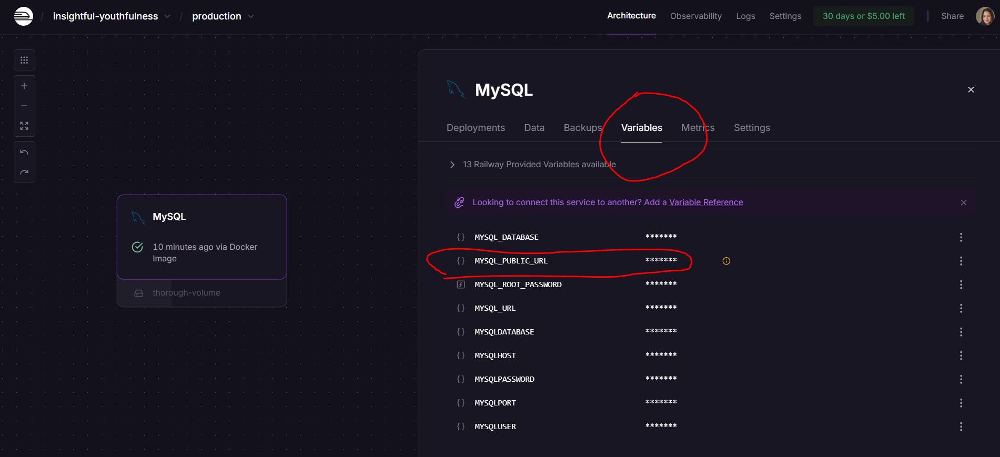

 - Crea una cuenta en [Docker hub](https://www.docker.com/products/docker-hub/) para subir imágenes de docker públicas - como un github pero de imágenes de docker -

## Configuración del archivo .env

Crea un archivo `.env` en la raíz de tu proyecto y añade las variables de conexión a tu base de datos:

```env
DB_NAME=nombre_base_de_datos
DB_USER=usuario
DB_PASSWORD=contraseña
DB_HOST=localhost  # o la dirección de tu servidor de base de datos
DB_PORT=3306       # o el puerto que uses (por defecto es 3306 para MySQL)
```

Y ahora creamos otro archivo  `.env.docker`

```env
DB_NAME=nombre_base_de_datos
DB_USER=usuario
DB_PASSWORD=contraseña
DB_HOST=db  # debe referenciar al servicio que creadp en docker
DB_PORT=3306       # o el puerto que uses (por defecto es 3306 para MySQL)
```

También puedes crear un archivo `.env.example` con la estructura que ves arriba.


### Cambia tu Seeting.py

```python
"""
Django settings for sistema_libros project.

Generated by 'django-admin startproject' using Django 5.1.3.

For more information on this file, see
https://docs.djangoproject.com/en/5.1/topics/settings/

For the full list of settings and their values, see
https://docs.djangoproject.com/en/5.1/ref/settings/
"""

from pathlib import Path
import os
from dotenv import load_dotenv
load_dotenv()  # Carga las variables del archivo .env

# Build paths inside the project like this: BASE_DIR / 'subdir'.
BASE_DIR = Path(__file__).resolve().parent.parent

# SECURITY WARNING: keep the secret key used in production secret!
SECRET_KEY = 'django-insecure-##=@&@l44guugi33-ch-eg1sw=&+q^_(+^_ci$3m_po01^#f28'

# SECURITY WARNING: don't run with debug turned on in production!
DEBUG = os.getenv('DEBUG', 'True').lower() == 'true'

# Configuración de hosts permitidos
ALLOWED_HOSTS = [
    'localhost',
    '127.0.0.1',
    '0.0.0.0',
    '.onrender.com',  # Para deployment en Render
    '.railway.app',   # Para deployment en Railway
    'django-crud-api-c2zm.onrender.com'
]

# Application definition
INSTALLED_APPS = [
    'django.contrib.admin',
    'django.contrib.auth',
    'django.contrib.contenttypes',
    'django.contrib.sessions',
    'django.contrib.messages',
    'django.contrib.staticfiles',
    'rest_framework',
    'corsheaders',  # Agregar CORS headers
    'libros',
    'categorias',
]

MIDDLEWARE = [
    'corsheaders.middleware.CorsMiddleware',  # Debe estar al principio
    'django.middleware.security.SecurityMiddleware',
    'django.contrib.sessions.middleware.SessionMiddleware',
    'django.middleware.common.CommonMiddleware',
    'django.middleware.csrf.CsrfViewMiddleware',
    'django.contrib.auth.middleware.AuthenticationMiddleware',
    'django.contrib.messages.middleware.MessageMiddleware',
    'django.middleware.clickjacking.XFrameOptionsMiddleware',
]

ROOT_URLCONF = 'sistema_libros.urls'

TEMPLATES = [
    {
        'BACKEND': 'django.template.backends.django.DjangoTemplates',
        'DIRS': [],
        'APP_DIRS': True,
        'OPTIONS': {
            'context_processors': [
                'django.template.context_processors.debug',
                'django.template.context_processors.request',
                'django.contrib.auth.context_processors.auth',
                'django.contrib.messages.context_processors.messages',
            ],
        },
    },
]

WSGI_APPLICATION = 'sistema_libros.wsgi.application'

# Database configuration
DATABASES = {
    'default': {
        'ENGINE': 'django.db.backends.mysql',
        'NAME': os.getenv('DB_NAME'),
        'USER': os.getenv('DB_USER'),
        'PASSWORD': os.getenv('DB_PASSWORD'),
        'HOST': os.getenv('DB_HOST'),
        'PORT': int(os.getenv('DB_PORT', 3306)),
        'OPTIONS': {
            'init_command': "SET sql_mode='STRICT_TRANS_TABLES'",
            'charset': 'utf8mb4',
        },
    }
}

# CORS Configuration
CORS_ALLOWED_ORIGINS = [
    "http://localhost:3000",      # React development
    "http://localhost:5173",      # Vite development
    "http://localhost:8080",      # Vue development
    "http://localhost:4200",      # Angular development
    "http://127.0.0.1:3000",
    "http://127.0.0.1:5173",
    "http://127.0.0.1:8080",
    "http://127.0.0.1:4200",
]

# Configuración para desarrollo (permite todos los orígenes) No recomendado para producción
if DEBUG:
    CORS_ALLOW_ALL_ORIGINS = True
else:
    # En producción, especifica orígenes específicos
    CORS_ALLOWED_ORIGINS += [
        "https://tu-frontend.onrender.com",
        "https://tu-frontend.vercel.app",
        "https://tu-frontend.netlify.app",
    ]

# Headers permitidos
CORS_ALLOW_HEADERS = [
    'accept',
    'accept-encoding',
    'authorization',
    'content-type',
    'dnt',
    'origin',
    'user-agent',
    'x-csrftoken',
    'x-requested-with',
]

# Métodos HTTP permitidos
CORS_ALLOW_METHODS = [
    'DELETE',
    'GET',
    'OPTIONS',
    'PATCH',
    'POST',
    'PUT',
]

# Permitir cookies en requests cross-origin
CORS_ALLOW_CREDENTIALS = True

# Password validation
AUTH_PASSWORD_VALIDATORS = [
    {
        'NAME': 'django.contrib.auth.password_validation.UserAttributeSimilarityValidator',
    },
    {
        'NAME': 'django.contrib.auth.password_validation.MinimumLengthValidator',
    },
    {
        'NAME': 'django.contrib.auth.password_validation.CommonPasswordValidator',
    },
    {
        'NAME': 'django.contrib.auth.password_validation.NumericPasswordValidator',
    },
]

# Internationalization
LANGUAGE_CODE = 'en-us'
TIME_ZONE = 'UTC'
USE_I18N = True
USE_TZ = True

# Static files (CSS, JavaScript, Images)
STATIC_URL = 'static/'

# Default primary key field type
DEFAULT_AUTO_FIELD = 'django.db.models.BigAutoField'

# REST Framework configuration
REST_FRAMEWORK = {
    'DEFAULT_PERMISSION_CLASSES': [
        'rest_framework.permissions.AllowAny',
    ],
    'DEFAULT_RENDERER_CLASSES': [
        'rest_framework.renderers.JSONRenderer',
    ],
}
```

 Una vez creada tu cuenta y tu base de datos y modificado el settings, haz en tu local:

 ```bash
 python manage.py makemigrations
 ```

  ```bash
 python manage.py migrate
 ```

## Dockerización

### Configuración

1. **Crear un archivo llamado `Dockefile` en la raíz del proyecto:**:

```docker
# Usa la imagen base de Python 3.12 en su versión "slim" (más liviana)
# "slim" significa que viene con menos paquetes preinstalados para reducir el tamaño
FROM python:3.12-slim

# Establece el directorio de trabajo dentro del contenedor como /app
# Todos los comandos siguientes se ejecutarán desde este directorio
WORKDIR /app

# Actualiza la lista de paquetes disponibles del sistema operativo
# && encadena comandos - si uno falla, se detiene la ejecución
RUN apt-get update \
# Instala paquetes del sistema operativo necesarios para compilar mysqlclient
# mysqlclient es una dependencia de Python que requiere compilación en C
&& apt-get install -y --no-install-recommends \
    build-essential \              
    # Conjunto de herramientas de compilación esenciales:
    # - make: para ejecutar makefiles
    # - gcc: compilador de C/C++
    # - libc6-dev: librerías de desarrollo de C
    # Sin esto, no se pueden compilar extensiones de Python en C
    gcc \                          
    # Compilador de C/C++ específicamente
    # mysqlclient tiene código en C que debe compilarse
    # Aunque está incluido en build-essential, se especifica explícitamente
    python3-dev \                  
    # Headers y archivos de desarrollo de Python
    # Contiene Python.h y otras cabeceras necesarias
    # para que las extensiones en C puedan "hablar" con Python
    # Sin esto, mysqlclient no puede integrarse con Python
    pkg-config \                   
    # Herramienta que ayuda a encontrar librerías instaladas
    # Proporciona información sobre dónde están las librerías
    # y qué flags de compilación usar
    # mysqlclient lo usa para encontrar las librerías de MySQL
    default-libmysqlclient-dev \   
    # Librerías de desarrollo del cliente MySQL
    # Contiene archivos .h (headers) y .so (librerías compartidas)
    # Permite que mysqlclient se comunique con bases de datos MySQL
    # Es la "interfaz" entre Python y MySQL
    libmariadb-dev \               
    # Librerías de desarrollo de MariaDB (fork de MySQL)
    # MariaDB es compatible con MySQL pero tiene mejores drivers
    # Proporciona una alternativa más moderna para la conexión
    # Muchas veces funciona mejor que las librerías nativas de MySQL
    # Operaciones de limpieza para reducir el tamaño final de la imagen Docker
    && apt-get clean \                 
    # Elimina archivos temporales del gestor de paquetes apt
    # Borra el caché de paquetes descargados (/var/cache/apt/archives/)
    # Estos archivos ya no son necesarios después de la instalación
    && rm -rf /var/lib/apt/lists/*     
    # Elimina las listas de paquetes disponibles
    # Estas listas se descargan con 'apt-get update'
    # Ocupan espacio y no son necesarias en el contenedor final
    # Pueden regenerarse si se necesitan con otro 'apt-get update'

# Copia el archivo requirements.txt desde tu máquina al directorio /app del contenedor
# El punto (.) significa "directorio actual" dentro del contenedor (/app)
COPY requirements.txt .

# Actualiza pip a la última versión disponible
RUN pip install --upgrade pip \
    # Instala todas las dependencias listadas en requirements.txt
    # --no-cache-dir evita guardar caché para reducir el tamaño de la imagen
    && pip install --no-cache-dir -r requirements.txt

# Copia todo el contenido del directorio actual (tu proyecto) al contenedor
# Primer punto: directorio actual de tu máquina
# Segundo punto: directorio actual del contenedor (/app)
COPY . .

# Informa que el contenedor expondrá el puerto 8000
# Esto es solo documentación - no abre el puerto automáticamente
EXPOSE 8010

# Comando que se ejecutará cuando el contenedor inicie
# Inicia el servidor de desarrollo de Django en el puerto 8010
# 0.0.0.0 permite conexiones desde cualquier IP (necesario para Docker)
CMD ["python", "manage.py", "runserver", "0.0.0.0:8010"]
```


2. **Crear un archivo llamado `docker-compose.yml` en la raíz del proyecto:**:

```docker
# Especifica la versión del formato de docker-compose a usar
version: '3.8'

# Define los servicios (contenedores) que componen la aplicación
services:
  
  # Servicio para la aplicación web Django
  web:
    # Construye la imagen usando el Dockerfile en el directorio actual (.)
    build: .
    
    # Mapeo de puertos: puerto_host:puerto_contenedor
    # Puerto 8000 de tu máquina → Puerto 8010 del contenedor
    ports:
      - "8000:8010"
    
    # Monta volúmenes: directorio_host:directorio_contenedor
    # El directorio actual (.) se monta en /app dentro del contenedor
    # Permite ver cambios en tiempo real sin reconstruir la imagen
    volumes:
      - .:/app
    
    # Variables de entorno que estarán disponibles dentro del contenedor
    environment:
      - DEBUG=1                    # Activa el modo debug de Django
      - DB_NAME=${DB_NAME}         # Nombre de la base de datos (desde .env.docker)
      - DB_USER=${DB_USER}         # Usuario de la base de datos (desde .env.docker)
      - DB_PASSWORD=${DB_PASSWORD} # Contraseña de la base de datos (desde .env.docker)
      - DB_HOST=db                 # Host de la base de datos (nombre del servicio MySQL)
      - DB_PORT=3306               # Puerto de MySQL (puerto estándar)
    
    # Define dependencias: este servicio espera a que 'db' esté disponible
    depends_on:
      - db  # El contenedor web esperará a que el contenedor db esté corriendo
    
    # Archivo adicional de variables de entorno
    # Las variables en este archivo estarán disponibles en el contenedor
    env_file:
      - .env.docker

  # Servicio para la base de datos MySQL
  db:
    # Usa la imagen oficial de MySQL versión 8 desde Docker Hub
    image: mysql:8
    
    # Variables de entorno específicas para configurar MySQL
    environment:
      MYSQL_DATABASE: ${DB_NAME}        # Crea automáticamente esta base de datos
      MYSQL_ROOT_PASSWORD: ${DB_PASSWORD} # Establece la contraseña del usuario root
    
    # Mapeo de puertos para MySQL
    # Puerto 3307 de tu máquina → Puerto 3306 del contenedor
    # Usa 3307 para evitar conflictos si tienes MySQL local en 3306
    ports:
      - "3307:3306"
    
    # Volumen persistente para los datos de MySQL
    # Los datos se guardan en el volumen 'mysql_data' para que persistan
    volumes:
      - mysql_data:/var/lib/mysql

# Define volúmenes con nombre que pueden ser reutilizados
volumes:
  # Volumen persistente para almacenar los datos de MySQL
  # Los datos sobrevivirán aunque se eliminen los contenedores
  mysql_data:
```

3. **Construir y ejecutar los contenedores:**

```bash
docker-compose up --build -d
```

Este comando construirá la imagen de Docker para el servicio web e iniciará los contenedores `web` y `db`.

4. **Aplicar migraciones:**

Una vez que los contenedores estén ejecutándose, necesitas aplicar las migraciones de la base de datos enotra terminal **NO DETENGAS EL PROCESO DE LOS CONTENEDORES (si no estás usando la flag -d que es del deamon)**:


```bash
docker-compose exec web python manage.py makemigrations
```

```bash
docker-compose exec web python manage.py migrate
```

5. **Crear un superusuario (opcional):**

Para acceder al panel de administración de Django:

```bash
docker-compose exec web python manage.py createsuperuser
```

### Comandos útiles de Docker

```bash
# Ver logs de los contenedores
docker-compose logs

# Ver logs específicos del servicio web
docker-compose logs web

# Detener los contenedores
docker-compose down

# Detener y eliminar volúmenes (cuidado: esto borrará los datos de la base de datos)
docker-compose down -v

# Reconstruir solo el servicio web
docker-compose build web

# Ejecutar comandos dentro del contenedor web
docker-compose exec web python manage.py shell
```

## Deployment a Docker Hub y Render

### Subir imagen a Docker Hub manualmente

### Desplegar en Docker Hub y Render

Estos son los pasos para construir tu imagen de Docker, subirla a Docker Hub y luego poder usarla en servicios como Render.

1.  **Construir la imagen Docker:**
    Este comando utiliza el `Dockerfile` en el directorio actual (`.`) para construir una nueva imagen.
    - `-t alexandrazambrano/django-crud-api:latest`: Asigna un "tag" o etiqueta a la imagen. El formato es `tu-usuario/nombre-de-la-imagen:version`. Esto la prepara para subirla a tu repositorio en Docker Hub.

    ```bash
    docker build -t alexandrazambrano/django-crud-api:latest .
    ```

2.  **Hacer login en Docker Hub:**
    Inicia sesión en tu cuenta de Docker Hub. Necesitarás reemplazar `<username>` con tu nombre de usuario. Es un requisito para poder subir imágenes.
    **Nota de seguridad:** Es más seguro omitir la contraseña en el comando para que se te solicite de forma interactiva, o usar un token de acceso.

    ```bash
    docker login -u <username>
    ```

3.  **Subir la imagen a Docker Hub:**
    Este comando publica la imagen que construiste en el repositorio de Docker Hub que especificaste con el tag. Una vez subida, estará disponible públicamente (o de forma privada, según la configuración de tu repositorio).

    ```bash
    docker push alexandrazambrano/django-crud-api:latest
    ```

4.  **Verificar localmente:**
    Este comando te permite confirmar que la imagen se ha creado correctamente en tu máquina local.
    - `docker images`: Lista todas las imágenes en tu sistema.
    - `| grep alexandrazambrano`: Filtra la lista para mostrar solo las imágenes que contienen "alexandrazambrano" en su nombre. (Nota: en Windows, puedes usar `findstr` en lugar de `grep`).

    ```bash
    docker images | grep alexandrazambrano
    ```

### Subir imagen a Render
1. Creamos un servicio en Render

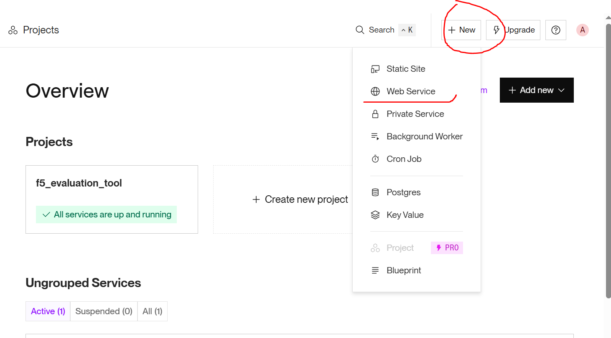
2. Agregaos la imagen de nuestro dockerhub

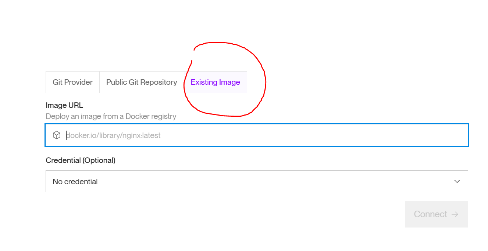

Ve a tu hub en docker hub, para eso, primero en cuentra la imágen con la letra de tu nombre o username, navega a tu perfil y allí verás esta vista:


entramos a nuestra imagen:

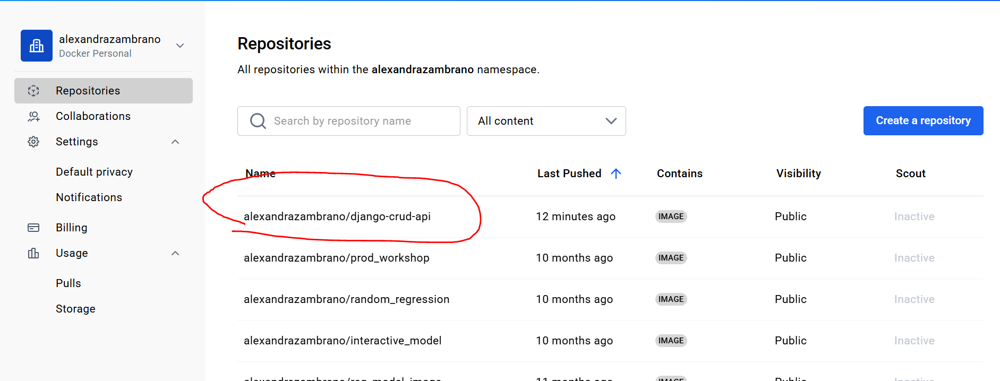

Buscamos la vista pública:

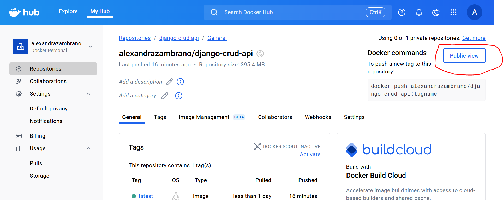

copiamos la url:

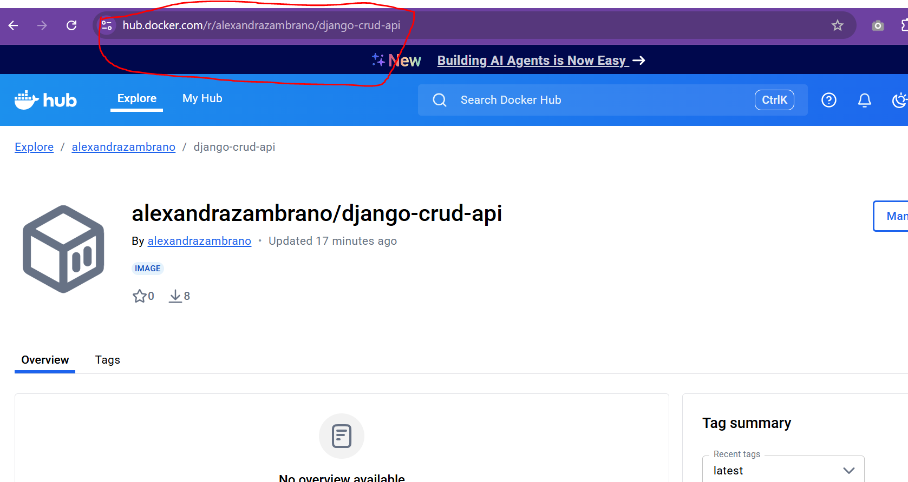

Agregamos nuestra imagen:

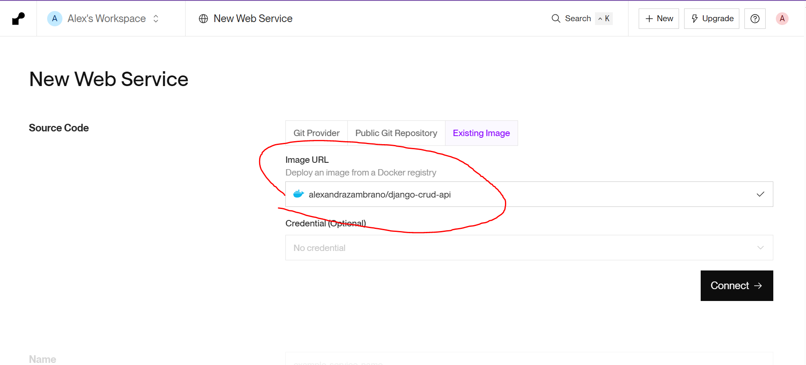
3. configuramos render:

Mantenemos las configuraciones, pero si quieres puedes cambiar el combre:

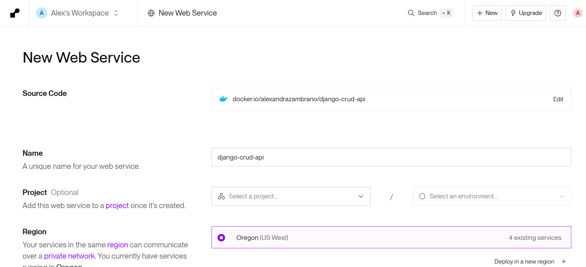

Bajamos un poco más, y seleccionamos el plan gratuito:

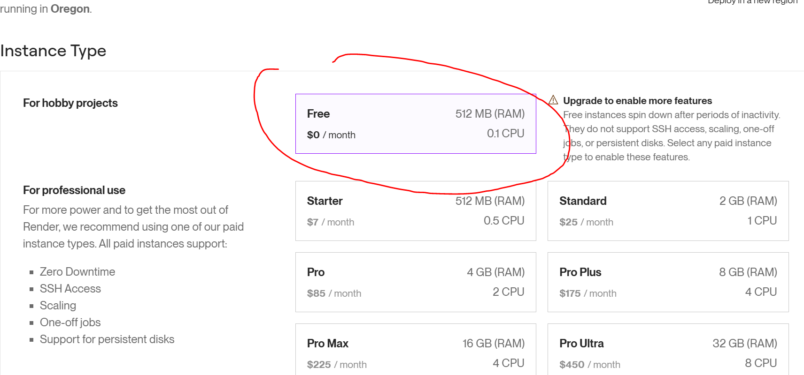

Agregamos nuestras variables de entorno:

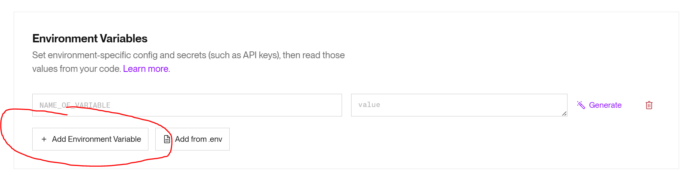

## Crea un categorias y libros con curl

Categorias:

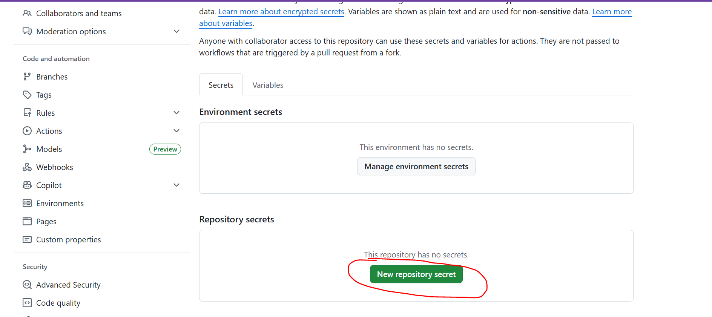

```bash
{
    "nombre_categoria": "Drama"
}
```
Libros:


```bash
{
  "titulo": "Cien años de soledad",
  "autor": "Gabriel García Márquez",
  "isbn": 9788437604958,
  "fecha_publicacion": "1967-06-05",
  "categorias": [
    2
  ]
}
```